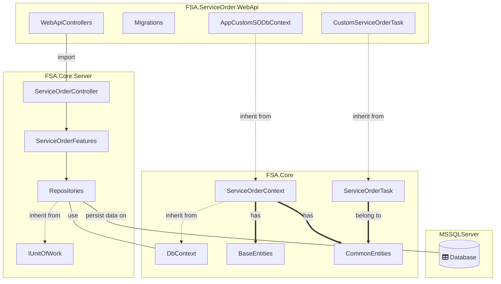

## Concepts and base architecture for Service Orders

The following document describes the bases for the implementation of a generic service order project that serves as a template for future client applications. In this way, the redefinition of common entities and functionalities between applications whose main business logic is based on service orders is avoided. This reuse is beneficial as it means writing less code and can allow the application to be standardized on a single implementation, following the Once, Once Only [DRY](https://en.wikipedia.org/wiki/Don%27t_repeat_yourself) principle.

## Technologies and patterns

* [ASP.NET Core 9](https://docs.microsoft.com/en-us/aspnet/core/introduction-to-aspnet-core)
* [Entity Framework Core 9](https://docs.microsoft.com/en-us/ef/core/)
* [MediatR](https://github.com/jbogard/MediatR)
* [FluentValidation](https://fluentvalidation.net/)
* [Vertical Slice Arch](https://learn.microsoft.com/en-us/archive/msdn-magazine/2016/september/asp-net-core-feature-slices-for-asp-net-core-mvc)

## Projects breakdown

The service order template is broken into 2 projects:

### FSA.Core

Class Library type project containing all the base entities, whether common nomenclators or entities, utilities as well as the DB context of the service orders.

### FSA.Core.Server

Class Library type project containing all the common logic (features) for managing service orders, includes definition of controllers with their respective routes and access permissions, definition of repositories as well as custom attributes and middlewares.

## Domain Model
### Base/common entities

## High level dependencies

## Service Order Base/Common Entities

### Base entities

##### DocumentType
<table  style="border: hidden;">
    <tr>
        <td style="width: 10%"></td>
        <td style="width: 90%"><ul>
            <li><strong>Inherit from</strong>: Master.cs</li>
            <li><strong>Path</strong>: FSA.Core\ServiceOrders\Models\Masters </li>
            <li><strong>Observations</strong>: Defines the types of documents that a service order can use. </li>
            <li><strong>CRUD Routes</strong>:  Poner ruta de controllers</li>
        </ul></td>
    </tr>
</table>

##### ServiceOrderTaskState
<table  style="border: hidden;">
    <tr>
        <td style="width: 10%"></td>
        <td style="width: 90%"><ul>
            <li><strong>Inherit from</strong>: Master.cs</li>
            <li><strong>Path</strong>: FSA.Core\ServiceOrders\Models\Masters </li>
            <li><strong>Observations</strong>: Defines the states through which a service order task can go through. </li>
            <li><strong>CRUD Routes</strong>:  Poner ruta de controllers</li>
        </ul></td>
    </tr>
</table>

##### ServiceOrderType
<table  style="border: hidden;">
    <tr>
        <td style="width: 10%"></td>
        <td style="width: 90%"><ul>
            <li><strong>Inherit from</strong>: Master.cs</li>
            <li><strong>Path</strong>: FSA.Core\ServiceOrders\Models\Masters </li>
            <li><strong>Observations</strong>: Defines the types of service orders for a given scenario. </li>
            <li><strong>CRUD Routes</strong>:  Poner ruta de controllers</li>
        </ul></td>
    </tr>
</table>

##### SupplyOperation
<table  style="border: hidden;">
    <tr>
        <td style="width: 10%"></td>
        <td style="width: 90%"><ul>
            <li><strong>Inherit from</strong>: Master.cs</li>
            <li><strong>Path</strong>: FSA.Core\ServiceOrders\Models\Masters </li>
            <li><strong>Observations</strong>: Defines the types of maintenance operations allowed in service orders. </li>
            <li><strong>CRUD Routes</strong>:  Poner ruta de controllers</li>
        </ul></td>
    </tr>
</table>

### Common entities

##### ServiceOrder
<table  style="border: hidden;">
    <tr>
        <td style="width: 10%"></td>
        <td style="width: 90%"><ul>
            <li><strong>Inherit from</strong>: Record.cs</li>
            <li><strong>Path</strong>: FSA.Core\ServiceOrders\Models\ </li>
            <li><strong>Observations</strong>:  Defines the main entity of this project, Service Order with its common characteristics.</li>
            <li><strong>Important</strong>:  This model can be extended in the client application.</li>
            <li><strong>CRUD Routes</strong>:  Poner ruta de controllers</li>
        </ul></td>
    </tr>
</table>

##### ServiceOrderFeature
<table  style="border: hidden;">
    <tr>
        <td style="width: 10%"></td>
        <td style="width: 90%"><ul>
            <li><strong>Inherit from</strong>: Record.cs</li>
            <li><strong>Path</strong>: FSA.Core\ServiceOrders\Models\ </li>
            <li><strong>Observations</strong>:  Defines the entity that stores all the geo features associated with a service order. A feature defines any topological element linked directly to the service order.</li>
            <li><strong>CRUD Routes</strong>:  Poner ruta de controllers</li>
        </ul></td>
    </tr>
</table>

##### ServiceOrderRegister
<table  style="border: hidden;">
    <tr>
        <td style="width: 10%"></td>
        <td style="width: 90%"><ul>
            <li><strong>Inherit from</strong>: Record.cs</li>
            <li><strong>Path</strong>: FSA.Core\ServiceOrders\Models\ </li>
            <li><strong>Observations</strong>: Defines the entity that stores the states through which a service order can transit. </li>
            <li><strong>CRUD Routes</strong>:  Poner ruta de controllers</li>
        </ul></td>
    </tr>
</table>

##### ServiceOrderTask
<table  style="border: hidden;">
    <tr>
        <td style="width: 10%"></td>
        <td style="width: 90%"><ul>
            <li><strong>Inherit from</strong>: Record.cs</li>
            <li><strong>Path</strong>: FSA.Core\ServiceOrders\Models\ </li>
            <li><strong>Observations</strong>: Defined as an abstract entity to be implemented directly from the client application that uses this service order template, it contains the bases to define, together with other properties, the tasks to be performed during the validity of a given service order.</li>
            <li><strong>Important</strong>:  It must be implemented in the client application.</li>
            <li><strong>CRUD Routes</strong>:  Poner ruta de controllers</li>
        </ul></td>
    </tr>
</table>

##### Supply
<table  style="border: hidden;">
    <tr>
        <td style="width: 10%"></td>
        <td style="width: 90%"><ul>
            <li><strong>Inherit from</strong>: Record.cs</li>
            <li><strong>Path</strong>: FSA.Core\ServiceOrders\Models\ </li>
            <li><strong>Observations</strong>: Defines the entity that stores the complementary maintenance operations involved in a given service order. </li>
            <li><strong>CRUD Routes</strong>:  Poner ruta de controllers</li>
        </ul></td>
    </tr>
</table>

##### Document
<table  style="border: hidden;">
    <tr>
        <td style="width: 10%"></td>
        <td style="width: 90%"><ul>
            <li><strong>Inherit from</strong>: Record.cs</li>
            <li><strong>Path</strong>: FSA.Core\ServiceOrders\Models\ </li>
            <li><strong>Observations</strong>: Defines a base entity that contains the common properties that all documents related to service orders must have. </li>
            <li><strong>CRUD Routes</strong>:  Poner ruta de controllers</li>
        </ul></td>
    </tr>
</table>

##### ServiceOrderDocument
<table  style="border: hidden;">
    <tr>
        <td style="width: 10%"></td>
        <td style="width: 90%"><ul>
            <li><strong>Inherit from</strong>: Document.cs</li>
            <li><strong>Path</strong>: FSA.Core\ServiceOrders\Models\ </li>
            <li><strong>Observations</strong>: Defines the entity that represents the documents associated with a given service order. </li>
            <li><strong>CRUD Routes</strong>:  Poner ruta de controllers</li>
        </ul></td>
    </tr>
</table>

##### ServiceOrderTaskDocument
<table  style="border: hidden;">
    <tr>
        <td style="width: 10%"></td>
        <td style="width: 90%"><ul>
            <li><strong>Inherit from</strong>: Document.cs</li>
            <li><strong>Path</strong>: FSA.Core\ServiceOrders\Models\ </li>
            <li><strong>Observations</strong>: Defines the entity that represents the documents associated with a task of a given service order. </li>
            <li><strong>CRUD Routes</strong>:  Poner ruta de controllers</li>
        </ul></td>
    </tr>
</table>