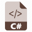

## Concepts and base architecture for Service Orders

The following document describes the bases for the implementation of a generic service order project that serves as a template for future client applications. In this way, the redefinition of common entities and functionalities between applications whose main business logic is based on service orders is avoided. This reuse is beneficial as it means writing less code and can allow the application to be standardized on a single implementation, following the Once, Once Only [DRY](https://en.wikipedia.org/wiki/Don%27t_repeat_yourself) principle.

## Technologies and patterns

* [ASP.NET Core 9](https://docs.microsoft.com/en-us/aspnet/core/introduction-to-aspnet-core)
* [Entity Framework Core 9](https://docs.microsoft.com/en-us/ef/core/)
* [MediatR](https://github.com/jbogard/MediatR)
* [FluentValidation](https://fluentvalidation.net/)
* [Vertical Slice Arch](https://learn.microsoft.com/en-us/archive/msdn-magazine/2016/september/asp-net-core-feature-slices-for-asp-net-core-mvc)

## Projects breakdown

The service order template is broken into 2 projects:

### FSA.Core

Class Library type project containing all the base entities, whether common nomenclators or entities, utilities as well as the DB context of the service orders.

### FSA.Core.Server

Class Library type project containing all the common logic (features) for managing service orders, includes definition of controllers with their respective routes and access permissions, definition of repositories as well as custom attributes and middlewares.

## Domain Model
### Base/common entities


## High level dependencies


## Service Order Base/Common Entities

### Base entities

##### DocumentType
<table  style="border: hidden;">
    <tr>
        <td style="width: 10%"></td>
        <td style="width: 90%"><ul>
            <li><strong>Inherit from</strong>: Master.cs</li>
            <li><strong>Path</strong>: FSA.Core\ServiceOrders\Models\Masters </li>
            <li><strong>Observations</strong>: Defines the types of documents that a service order can use. </li>
            <li><strong>CRUD Routes</strong>:  Poner ruta de controllers</li>
        </ul></td>
    </tr>
</table>

##### ServiceOrderTaskState
<table  style="border: hidden;">
    <tr>
        <td style="width: 10%"></td>
        <td style="width: 90%"><ul>
            <li><strong>Inherit from</strong>: Master.cs</li>
            <li><strong>Path</strong>: FSA.Core\ServiceOrders\Models\Masters </li>
            <li><strong>Observations</strong>: Defines the states through which a service order task can go through. </li>
            <li><strong>CRUD Routes</strong>:  Poner ruta de controllers</li>
        </ul></td>
    </tr>
</table>

##### ServiceOrderType
<table  style="border: hidden;">
    <tr>
        <td style="width: 10%"></td>
        <td style="width: 90%"><ul>
            <li><strong>Inherit from</strong>: Master.cs</li>
            <li><strong>Path</strong>: FSA.Core\ServiceOrders\Models\Masters </li>
            <li><strong>Observations</strong>: Defines the types of service orders for a given scenario. </li>
            <li><strong>CRUD Routes</strong>:  Poner ruta de controllers</li>
        </ul></td>
    </tr>
</table>

##### SupplyOperation
<table  style="border: hidden;">
    <tr>
        <td style="width: 10%"></td>
        <td style="width: 90%"><ul>
            <li><strong>Inherit from</strong>: Master.cs</li>
            <li><strong>Path</strong>: FSA.Core\ServiceOrders\Models\Masters </li>
            <li><strong>Observations</strong>: Defines the types of maintenance operations allowed in service orders. </li>
            <li><strong>CRUD Routes</strong>:  Poner ruta de controllers</li>
        </ul></td>
    </tr>
</table>

### Common entities

##### ServiceOrder
<table  style="border: hidden;">
    <tr>
        <td style="width: 10%"></td>
        <td style="width: 90%"><ul>
            <li><strong>Inherit from</strong>: Record.cs</li>
            <li><strong>Path</strong>: FSA.Core\ServiceOrders\Models\ </li>
            <li><strong>Observations</strong>:  Defines the main entity of this project, Service Order with its common characteristics.</li>
            <li><strong>Important</strong>:  This model can be extended in the client application.</li>
            <li><strong>CRUD Routes</strong>:  Poner ruta de controllers</li>
        </ul></td>
    </tr>
</table>

##### ServiceOrderFeature
<table  style="border: hidden;">
    <tr>
        <td style="width: 10%"></td>
        <td style="width: 90%"><ul>
            <li><strong>Inherit from</strong>: Record.cs</li>
            <li><strong>Path</strong>: FSA.Core\ServiceOrders\Models\ </li>
            <li><strong>Observations</strong>:  Defines the entity that stores all the geo features associated with a service order. A feature defines any topological element linked directly to the service order.</li>
            <li><strong>CRUD Routes</strong>:  Poner ruta de controllers</li>
        </ul></td>
    </tr>
</table>

##### ServiceOrderRegister
<table  style="border: hidden;">
    <tr>
        <td style="width: 10%"></td>
        <td style="width: 90%"><ul>
            <li><strong>Inherit from</strong>: Record.cs</li>
            <li><strong>Path</strong>: FSA.Core\ServiceOrders\Models\ </li>
            <li><strong>Observations</strong>: Defines the entity that stores the states through which a service order can transit. </li>
            <li><strong>CRUD Routes</strong>:  Poner ruta de controllers</li>
        </ul></td>
    </tr>
</table>

##### ServiceOrderTask
<table  style="border: hidden;">
    <tr>
        <td style="width: 10%"></td>
        <td style="width: 90%"><ul>
            <li><strong>Inherit from</strong>: Record.cs</li>
            <li><strong>Path</strong>: FSA.Core\ServiceOrders\Models\ </li>
            <li><strong>Observations</strong>: Defined as an abstract entity to be implemented directly from the client application that uses this service order template, it contains the bases to define, together with other properties, the tasks to be performed during the validity of a given service order.</li>
            <li><strong>Important</strong>:  It must be implemented in the client application.</li>
            <li><strong>CRUD Routes</strong>:  Poner ruta de controllers</li>
        </ul></td>
    </tr>
</table>

##### Supply
<table  style="border: hidden;">
    <tr>
        <td style="width: 10%"></td>
        <td style="width: 90%"><ul>
            <li><strong>Inherit from</strong>: Record.cs</li>
            <li><strong>Path</strong>: FSA.Core\ServiceOrders\Models\ </li>
            <li><strong>Observations</strong>: Defines the entity that stores the complementary maintenance operations involved in a given service order. </li>
            <li><strong>CRUD Routes</strong>:  Poner ruta de controllers</li>
        </ul></td>
    </tr>
</table>

##### Document
<table  style="border: hidden;">
    <tr>
        <td style="width: 10%"></td>
        <td style="width: 90%"><ul>
            <li><strong>Inherit from</strong>: Record.cs</li>
            <li><strong>Path</strong>: FSA.Core\ServiceOrders\Models\ </li>
            <li><strong>Observations</strong>: Defines a base entity that contains the common properties that all documents related to service orders must have. </li>
            <li><strong>CRUD Routes</strong>:  Poner ruta de controllers</li>
        </ul></td>
    </tr>
</table>

##### ServiceOrderDocument
<table  style="border: hidden;">
    <tr>
        <td style="width: 10%"></td>
        <td style="width: 90%"><ul>
            <li><strong>Inherit from</strong>: Document.cs</li>
            <li><strong>Path</strong>: FSA.Core\ServiceOrders\Models\ </li>
            <li><strong>Observations</strong>: Defines the entity that represents the documents associated with a given service order. </li>
            <li><strong>CRUD Routes</strong>:  Poner ruta de controllers</li>
        </ul></td>
    </tr>
</table>

##### ServiceOrderTaskDocument
<table  style="border: hidden;">
    <tr>
        <td style="width: 10%"></td>
        <td style="width: 90%"><ul>
            <li><strong>Inherit from</strong>: Document.cs</li>
            <li><strong>Path</strong>: FSA.Core\ServiceOrders\Models\ </li>
            <li><strong>Observations</strong>: Defines the entity that represents the documents associated with a task of a given service order. </li>
            <li><strong>CRUD Routes</strong>:  Poner ruta de controllers</li>
        </ul></td>
    </tr>
</table>


## How to use

### Install corresponding package. 

To use this template for creating service orders, the first thing we must do is install the **FSA.Core.Server** nuget package.

To install the aforementioned package we must add a custom nuget source, to do this we follow the following steps:

1- Open Visual Studio, and then select Tools > Options.

2- Select **NuGet Package Manager**, and then select **Package Sources**.

3- Enter your feed's Name and the Source URL, put the following value https://pkgs.dev.azure.com/fsaltdaqqp/_packaging/FSA.NugetPackages%40Local/nuget/v3/index.json and then select the green (+) sign to add a new package source.

4- Select **OK** when you're done.

##### If you use Visual Studio Code, these are the steps to follow:

Poner los pasos a seguir para adicionar un custom source de nuget desde visual studio code

Once the custom nuget source is configured, we only have to install the **FSA.Core.Server** package and start invoking the functionalities that said package provides us

To use the **NuGet Package Manager** to install the **FSA.Core.Server** package in Visual Studio, follow these steps:

Select **Project** > **Manage NuGet Packages**.


In the **NuGet Package Manager** page, choose the custom package name (step 3 previously mentioned) as the **Package source**.

From the Browse tab, search for ***FSA.Core.Server***, select **FSA.Core.Server** in the list, and then select **Install**.


> [!IMPORTANT]  
> Don't forget to install the following packages:
>- [Microsoft.EntityFrameworkCore.SqlServer](https://www.nuget.org/packages/Microsoft.EntityFrameworkCore.SqlServer)
>- [Microsoft.EntityFrameworkCore.Tools](https://www.nuget.org/packages/Microsoft.EntityFrameworkCore.Tools)


### Using the FSA.Core.Server package

Once the FSA.Core.Server package is installed, you must proceed with the following steps to use its functionalities:

1- Create a project using the **ASP.NET Core Web Api** visual studio template 


   or using .NET Core CLI with the following command

###### Without specifying a name:
```cs
dotnet new webapi
```
######  With a specified name:
```cs
dotnet new webapi --name MyFirstWebAPIProject
```

2- Create a class that implements the abstract class ServiceOrderTask, this new class would extend the abstract class by incorporating new members.
<a id="third-heading2"></a>
```cs
public class CustomServiceOrderTask : ServiceOrderTask
{
    public string CustomFieldSOTask { get; set; } = string.Empty;
}
```

3- Another class that can be extended is the ServiceOrder model, for this we create a new class that inherits from the aforementioned model and that will have its own members.
<a id="third-heading1"></a>
```cs
public class CustomServiceOrder: ServiceOrder
{
    public int CustomField { get; set; }
}
```

4- Create a class that inherits from the ServiceOrderContext class, as follows

```cs
public class AppDbContext : ServiceOrderContext
{
    public AppDbContext(DbContextOptions<AppDbContext> options, IHttpContextAccessorManager httpContextAccessorManager)
        : base(options, httpContextAccessorManager)
    {
    }

    protected override void OnModelCreating(ModelBuilder modelBuilder)
    {
        modelBuilder.Entity<CustomServiceOrderTask>();

        modelBuilder.Entity<ServiceOrderTask>()
        .HasDiscriminator<string>("TypeEntity")
        .HasValue<CustomServiceOrderTask>("CustomServiceOrderTask");

        modelBuilder.Entity<CustomServiceOrder>(e =>
        {
        });
    }
}
```

The ServiceOrderContext class contains all the DBSets with the common collections for working with service orders, this saves time declaring/implementing functionalities.

5- The values ​​for the connection string are specified in the 'appSettings.json' file

```cs
"ConnectionStrings": {
  "DBConnection": "Server=server;Database=db;User Id=user;Password=password;TrustServerCertificate=True"
}
```

6- Using the following instruction, the first migration is created to specify our tables in the database

```cs
Add-Migration InitialCreate -p WebApplication1 -c AppDbContext -o Data/Migrations -s WebApplication1
```
where:

- -p: Project name
- -c: Context name
- -o: Output path
- -s: Solution name

7- The following code blocks are specified in the **Program.cs** class

The following code block must be specified just before the line **var app = builder.Build();** in the **Program.cs** class

```cs
#region FSA CoreServer
builder.Services.AddFSACoreServerServices(builder.Configuration);
builder.Services.AddFSASwaggerDocumentationServices("FSA ServiceOrders Test Api", "v1");
builder.Services.AddFSAServiceOrderDbContext<AppDbContext>(options =>
{
options.UseSqlServer(builder.Configuration.GetConnectionString("DBConnection")); 
//It must match the name previously specified in the appSettings.json file. En este caso 'DBConnection'.
});
builder.Services.AddFSAServiceOrderFeaturesServices();
#endregion

builder.Services.AddAntiforgery();
```
And just below the app.UseHttpsRedirection(); line, the following block is specified

```cs
#region FSA CoreServer

await app.Services.InitialiseDatabaseAsync<AppDbContext>();
app.UseFSACoreServerServices();
app.MapFSAServiceOrderRoutes();

app.UseAntiforgery();

#endregion
```

8- Finally, we run the web api project. If we don't have any errors, we should have our API project running. If we access our database we can verify that our DB with all the tables related to service orders have been created.


And we verify that for the particular case of the ServiceOrderTask and ServiceOrder models that were extended with new members, these have been created.

| [Service Order extended model](#third-heading1)    | [Service Order Task extended model](#third-heading2)  |
| :--------: | :-------: |
|   |     |