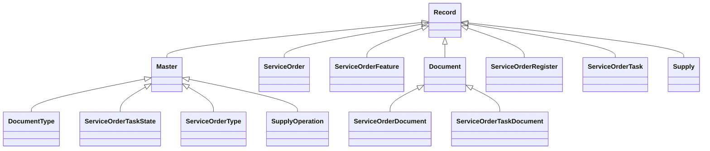

```mermaid
classDiagram

class Record{
    
}

class DocumentType{
    
}

class ServiceOrderTaskState{
    
}

class ServiceOrderType{
    
}

class SupplyOperation{
    
}

class Document{
    
}

class ServiceOrderDocument{
    
}

class ServiceOrderTaskDocument{
    
}

class ServiceOrder{
    
}

class ServiceOrderFeature{
    
}

class Master{
    
}

class ServiceOrderRegister{
    
}

class ServiceOrderTask{
    
}

class Supply{
     
}

Record <|-- Master
Master <|-- DocumentType
Master <|-- ServiceOrderTaskState
Master <|-- ServiceOrderType
Master <|-- SupplyOperation

Record <|-- Document
Record <|-- ServiceOrder
Record <|-- ServiceOrderFeature
Record <|-- ServiceOrderRegister
Record <|-- ServiceOrderTask
Record <|-- Supply

Document <|-- ServiceOrderDocument
Document <|-- ServiceOrderTaskDocument

```